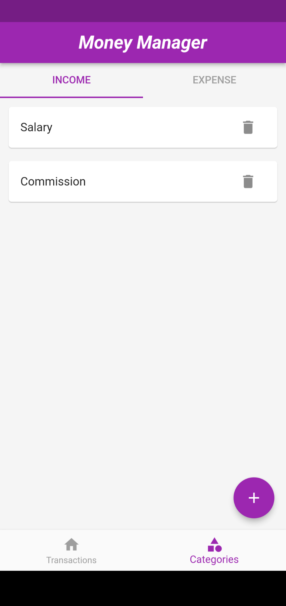
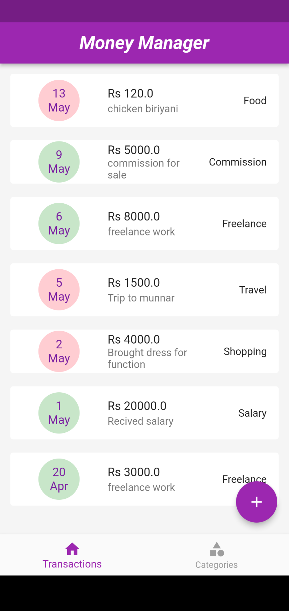
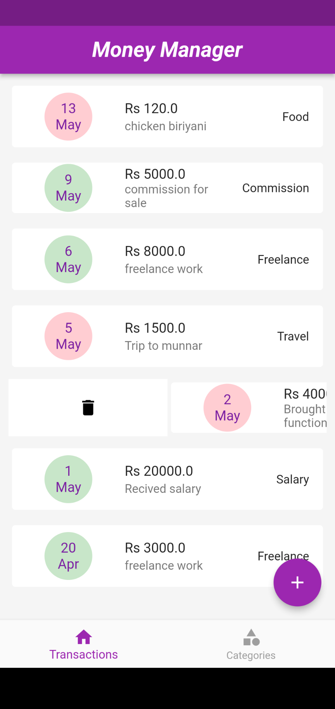

# personalmoneymanagerapp

Personal money manager app using flutter with Hive database

## Getting Started

**Packages we are using:**

- [hive_generator](https://pub.dev/packages/hive_generator)
- [build_runner](https://pub.dev/packages/build_runner)
- [get](https://pub.dev/packages/get)
- [hive](https://pub.dev/packages/hive) 
- [hive_flutter](https://pub.dev/packages/hive_flutter)
- [intl](https://pub.dev/packages/intl)
- [flutter_slidable](https://pub.dev/packages/flutter_slidable)

For get more packages click [here](https://pub.dev)
  
  
YouTube Link : [PersonalMoneyManagerUI](https://youtu.be/lU4z8E1IbYk)
